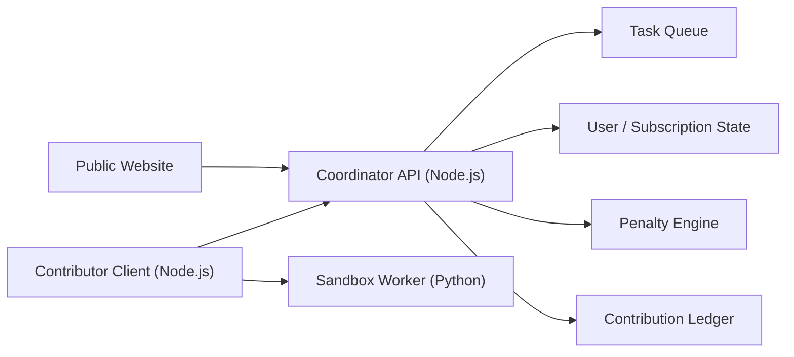

# Purple Bee Contributor Subscription MVP

## 1. Product summary

Purple Bee runs a distributed compute platform with two user classes:

1. Free user
- limited requests
- lower priority queue
- lightweight or older models only

2. Contributor subscriber
- reserves contribution time
- shares idle local resources during that time
- earns premium access for a period

Premium benefits:
- faster queue
- access to better models
- relaxed rate limits

## 2. Why a native contributor client is required

The browser can estimate memory, storage, and thread count, but it cannot reliably inspect the user's true hardware components.

To support:
- real CPU model
- real RAM total
- real GPU model
- accurate disk capacity
- idle / active user detection
- safe background task execution

Purple Bee needs a native contributor client.

Website role:
- onboarding
- schedule reservation
- subscription display
- contribution history

Contributor client role:
- collect actual hardware info with permission
- enforce CPU / GPU caps
- pause when user returns
- execute sandboxed jobs
- report results and contribution credits

## 3. MVP architecture

## 4. Server architecture

Coordinator server responsibilities:
- user state
- contributor registration
- hardware profile storage
- reservation scheduling
- contribution session tracking
- work distribution
- queue prioritization
- subscription activation
- penalty application

Recommended production path later:
- Node.js API
- PostgreSQL
- Redis queue
- object storage for task payloads

MVP in this folder:
- Express server
- in-memory store
- simple queue and scheduler logic

## 5. Client architecture

Contributor client responsibilities:
- read real hardware information
- join scheduled contribution sessions
- claim work units
- enforce max CPU usage policy
- pause when the user becomes active again
- execute sandboxed jobs
- upload results
- send heartbeat and contribution minutes

MVP implementation here:
- Node.js client
- `systeminformation` for hardware inspection
- child process execution of a Python worker

## 6. Work distribution model

Only small, restartable jobs should be distributed in MVP.

Suitable task types:
- text preprocessing
- document chunking
- summary candidate generation
- embedding preparation
- lightweight inference batches

Queue rules:
- free-user jobs go to standard queue
- contributor-subscriber jobs go to premium queue
- contributors receive jobs only when:
  - reservation is active
  - machine health is acceptable
  - user is idle
  - local usage caps are not exceeded

Retry behavior:
- if a node fails or disconnects, the task is re-queued
- repeated task failure marks task as quarantined

## 7. Contribution-time scoring logic

Contribution score should depend on:
- active contributed minutes
- hardware tier multiplier
- completion success ratio
- actual job throughput

Example base mapping:
- 60 contributed minutes -> 1 premium day
- 300 contributed minutes -> 7 premium days

Hardware multiplier examples:
- low tier: x0.8
- standard tier: x1.0
- high tier: x1.4

Effective contribution minutes:

`effectiveMinutes = rawMinutes * hardwareMultiplier * reliabilityMultiplier`

Reliability multiplier can be reduced by:
- early exit
- missed schedule
- failed heartbeats

## 8. Subscription activation logic

Premium is granted from contribution ledger thresholds.

Example:
- effective minutes >= 60 -> activate 1 day
- effective minutes >= 300 -> activate 7 days

MVP rule:
- when evaluation runs, ledger minutes are consumed into subscription time
- subscription end extends if already active

## 9. Penalty logic

Missed contribution reservations should not destroy trust immediately, but must preserve fairness.

Escalation:
- 1st miss: warning
- 2nd miss: reduced contribution efficiency for a cooldown period
- 3rd miss: temporary contribution restriction
- repeated abuse: longer restriction

Penalty inputs:
- reservation not started
- early stop without reason
- repeated disconnects

## 10. Safety model

MVP safety rules:
- no full system takeover
- explicit CPU cap in client config
- only sandboxed task types
- pause on user activity
- each task is time-limited
- all results validated server-side

For production:
- Docker or WebAssembly sandbox
- signed task payloads
- attestation for approved client versions
- encrypted task bundles

## 11. UX requirements

Website:
- reserve contribution time
- see active premium status
- see upcoming contribution schedule
- see contribution progress
- see hardware recommendation

Client:
- show current machine status
- show current contribution session
- show CPU cap and pause reason
- show earned premium estimate

## 12. Suggested roadmap

Phase 1:
- contributor desktop client
- coordinator API
- queue + subscription logic

Phase 2:
- durable DB + Redis
- signed job packages
- better hardware scoring

Phase 3:
- broader task catalog
- premium routing into Purple Bee main inference fabric
