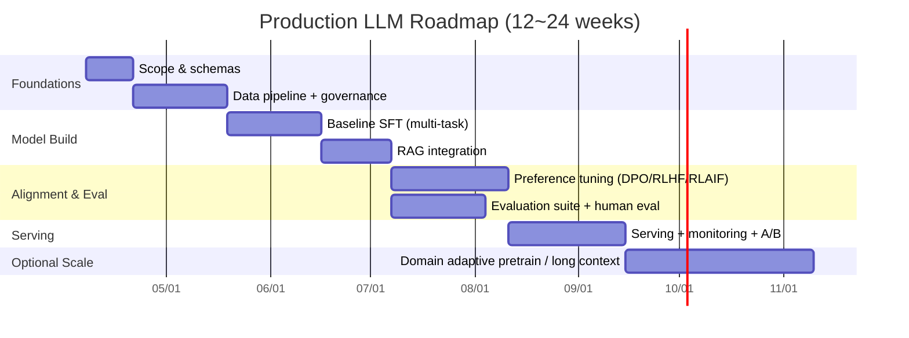

# 프로덕션급 감정·공감·맥락이해 통합 자연어 모델 구축 심층 보고서

## 요약

본 보고서는 “감정 인지(Emotion Detection)–공감 생성(Empathy Generation)–문제상황 이해(Problem/Situation Understanding)–주제 식별(Topic Identification)–담화 흐름 추적(Discourse/Flow Tracking)–장문·대화 문맥 이해(Context Comprehension)”를 **단일 모델/단일 제품 수준에서 안정적으로 제공**하기 위한 생산(Production) 관점의 설계·학습·데이터·평가·서빙·안전·MLOps를 통합적으로 정리한다. 핵심 결론은, **(A) 디코더-온리 Transformer 기반의 지시튜닝(Instruction tuning) LLM을 주축으로**, (B) **RAG(검색결합 생성)** 및 (C) **대화 상태/감정 상태를 구조화해 추적하는 “상태 추정 + 생성” 멀티태스크 학습**을 결합하는 것이 비용 대비 성능과 운영 안정성의 균형이 가장 좋다는 점이다. Transformer는 병렬 학습과 범용 전이 성능에서 여전히 주류이며 citeturn0search0, RAG는 지식집약 과제에서 성능 및 근거제시·업데이트 가능성을 제공한다 citeturn0search1turn17search3.

아키텍처 측면에서 권장되는 “기본형”은 **RoPE/ALiBi 기반 위치부호화 + GQA/FlashAttention 계열 최적화 + (필요 시) MoE**를 탑재한 디코더 LLM이다 citeturn27search1turn27search2turn27search0turn1search2turn27search4turn3search0. 장문 문맥은 단순히 컨텍스트 윈도우 확장만으로 해결되지 않으므로, LongBench/L-Eval/RULER 같은 장문 벤치마크를 기반으로 “실제 유효 컨텍스트”를 측정하고, RAG·요약 메모리·상태추적을 함께 설계해야 한다 citeturn9search0turn9search5turn9search2.

학습은 (1) **대규모 일반 코퍼스 사전학습(또는 강력한 오픈 베이스모델 채택)**, (2) **멀티태스크 SFT(감정/주제/상태/안전/도구사용 포함)**, (3) **선호학습(Preference learning: RLHF 또는 DPO 계열)**의 3단계를 권장한다. RLHF의 효과와 비용 구조는 InstructGPT에서 체계적으로 보고되었고 citeturn0search2, DPO는 보상모델·PPO 없이 선호데이터로 직접 최적화하는 방식으로 널리 쓰인다 citeturn0search3. 데이터 전략은 공개 벤치마크(GoEmotions, EmpatheticDialogues, DailyDialog, MELD, SQuAD, Natural Questions, HotpotQA, XSum, CommonsenseQA, FLAN, Self-Instruct 등)와 한국어 리소스(KorQuAD, KLUE, AI Hub 감성/대화 데이터)를 혼합하고 citeturn4search0turn4search1turn5search2turn4search2turn6search8turn6search1turn6search2turn7search0turn7search3turn8search0turn8search1turn6search7turn13search3turn4search3, **부족한 “감정·공감·상황·담화” 결함을 합성데이터로 보강하되(Self-Instruct 류), 엄격한 필터링·검수·오염(Leakage) 통제를 동반**하는 것이다 citeturn8search1turn16search0.

평가는 **능력별 자동평가 + 사람평가(블라인드 A/B) + 운영지표(실시간 모니터링)**의 3층 구조가 필요하다. 자동평가는 MMLU/BIG-bench/HELM/TruthfulQA/RealToxicityPrompts/StereoSet/CrowS-Pairs/LongBench 등을 조합하고 citeturn13search1turn13search2turn13search0turn7search2turn11search3turn12search0turn12search1turn9search0, 대화 품질은 MT-Bench·Chatbot Arena·AlpacaEval 같은 LLM-judge 기반 평가를 참고하되(편향 보정 포함) citeturn15search0turn15search1turn15search2, 공감/정서 적합성은 전용 휴먼 프로토콜이 핵심이다 citeturn4search1turn5search8. 안전·윤리·규제 대응은 NIST AI RMF, EU AI Act, Model Cards/Datasheets 관행을 기반으로 “데이터–모델–배포” 전 과정에 체크포인트를 두는 것을 권고한다 citeturn11search0turn11search5turn11search2turn12search2.

가정(불명확 항목): 목표 언어는 **한국어 중심 + (선택) 영어 혼합**, 목표 지연시간은 **대화형(수 초 이내 초기 토큰 스트리밍)**, 컴퓨팅 예산은 **오픈형(단일 노드~수십/수백 GPU 클러스터)**로 두고, 로드맵·비용 표는 **범위(저/중/고)**로 제시한다.

## 요구 역량 정의와 시스템 설계 원칙

감정/공감/상황이해/주제/담화/문맥이해를 “모델 하나가 잘한다”로 표현하면 요구가 모호해지므로, 프로덕션에서는 아래처럼 **기능을 분해하고 출력 스키마를 명시**하는 것이 설계·학습·평가를 단순화한다.

첫째, **상태 추정(Perception/State Estimation)**: (a) 사용자 정서(범주·강도), (b) 대화 의도/대화행위(Dialog Act), (c) 문제 유형(정보탐색/디버깅/상담/갈등/의사결정 등), (d) 주제/서브주제, (e) 대화 상태(슬롯/제약/선호) 및 담화 구조(전환·참조·목표)를 추정한다. 대규모 멀티턴 대화에서 이러한 상태는 MultiWOZ 같은 DST 데이터가 제공하는 “상태 추적” 태스크로 구체화 가능하다 citeturn9search3turn9search7turn13search3. 담화 수준에서는 PDTB/RST 같은 담화관계 주석 코퍼스가 “흐름/연결”을 정형화한다 citeturn10search4turn10search1.

둘째, **반응 계획(Policy/Planning)**: (a) 공감 전략(인정/반영/정서 명명/질문/제안/경계설정), (b) 문제해결 전략(추가정보 요구, 단계적 해결, 검증·테스트, 도구호출, 근거제시), (c) 안전 정책(금지·제한, 리스크 안내, 개인정보 최소화)을 선택한다. RLHF/선호학습은 바로 이 “어떤 답을 더 선호해야 하는가”를 학습시키는 후처리 단계로 자리 잡았다 citeturn0search2turn0search3turn16search2.

셋째, **표현 생성(Realization/Generation)**: 계획을 자연스러운 텍스트로 구현하되, 감정/공감/논리/근거 인용이 일관되도록 한다. Transformer는 이 범용 생성의 핵심 기반이다 citeturn0search0.

지식 최신성·근거제시 요구가 큰 제품에서는, **RAG를 기본 옵션**으로 두는 것이 “환각(hallucination)–구식 정보–근거 부재” 문제를 완화하는 실무적 선택이다. RAG는 파라메트릭 메모리(모델 가중치)와 비파라메트릭 메모리(문서 인덱스)를 결합하는 대표 접근으로 제시되었다 citeturn0search1.

## 권장 아키텍처 패턴

### 디코더 LLM 백본

기본 백본은 **디코더-온리 Transformer**를 권장한다. 이는 대화·지시따르기·코드·요약 등 다양한 생성 과제에 일관된 인터페이스를 제공하며, 확장성과 성능의 검증도 가장 많이 축적되어 있다 citeturn0search0turn13search0.

장문·서빙 효율을 위해 다음 구성 요소를 우선 고려한다.

- **위치부호화**: RoPE(회전 위치 임베딩) 또는 ALiBi(선형 바이어스)는 장문 확장과 추론 호환성 측면에서 널리 쓰인다 citeturn27search1turn27search2.  
- **KV 캐시 비용 절감**: GQA는 KV head 수를 줄여 추론 메모리·대역폭을 낮추면서 품질을 유지하는 설계를 제공한다 citeturn27search0turn27search3.  
- **어텐션 커널 최적화**: FlashAttention/FlashAttention-2는 메모리 IO를 줄여 장문에서 속도/메모리를 개선한다 citeturn1search2turn27search4.  
- **초대형 확장(선택)**: MoE는 “파라미터 수는 크게, 토큰당 연산은 제한”하는 방식으로 확장 비용을 낮출 수 있으나, 라우팅·통신·학습 안정성 부담이 있다 citeturn3search0.

Transformer 대안으로는 SSM 계열(예: Mamba)이 장문에서 선형 시간 특성을 통해 추론 효율을 강조하지만 citeturn3search1, “공감·담화·도구사용”처럼 다양한 생성/정합 과제까지 포함한 프로덕션 요구에서는 생태계·검증·도구 호환성 측면에서 Transformer가 여전히 기본 선택이 되는 경우가 많다(이 판단은 조직의 엔지니어링 역량/리스크 성향에 따라 달라짐).

### RAG와 장기 메모리 결합

RAG는 “모델이 답을 만들어내기 전에, 관련 문서를 검색해 근거 컨텍스트를 주입”하는 구조로 제시되었다 citeturn0search1. 더 나아가 REALM처럼 **사전학습 단계부터 검색기를 결합**하는 접근도 있다 citeturn17search3. 벡터 검색 인프라는 FAISS 같은 고성능 최근접 검색(ANN) 라이브러리에 기반해 구현하는 경우가 많다 citeturn17search0.

아래는 “대화형 공감+문제해결” 제품에서 자주 쓰이는 **2-레벨 메모리**(단기: KV/요약, 장기: 벡터DB+문서) 패턴이다.

```mermaid
flowchart LR
  U[User Utterance] --> P[Preprocessor: lang detect, PII scrub]
  P --> S[State Estimator: emotion/topic/intent/discourse]
  P --> Q[Query Builder]
  Q --> R[Retriever: BM25 + Dense]
  R --> V[(Vector/Doc Index)]
  R --> C[Context Packager: cite chunks]
  S --> LLM[LLM Backbone: decoder-only]
  C --> LLM
  LLM --> A[Answer + (optional) structured state JSON]
  A --> M[Memory: summary + embeddings]
  M --> V
```

RAG 구성에서 토큰 절약을 위해 **(1) BM25(희소) + (2) Dense Retriever(밀집) 하이브리드**를 권장하는 경우가 많다. BM25 계열의 고전적 근거는 Okapi 계열 연구 흐름에서 확인할 수 있다 citeturn17search6. (실무적으로는 “쿼리 재작성 + 하이브리드 검색 + 재랭킹”이 일반적이지만, 재랭커 선택은 도메인별 튜닝이 필요해 본 보고서에서는 원리를 중심으로 다룬다.)

image_group{"layout":"carousel","aspect_ratio":"16:9","query":["transformer architecture diagram self attention","retrieval augmented generation pipeline diagram","vector database embedding retrieval diagram"],"num_per_query":1}

### 멀티모달 옵션

감정 인지의 품질은 텍스트만으로도 크게 개선 가능하지만, 음성·영상·표정·대화 맥락이 중요하면 멀티모달이 유리하다. 예를 들어 MELD는 텍스트와 함께 오디오/비주얼을 포함한 다자 대화 감정 인식 데이터셋으로 소개된다 citeturn4search2turn4search10. 시각-언어 사전학습은 CLIP이 “언어-이미지 대조학습” 패러다임을 확산시켰고 citeturn3search2turn3search14, Flamingo는 강력한 비전·언어 백본을 연결하는 VLM 설계를 제시한다 citeturn3search3turn3search21. 다만 멀티모달은 데이터/라벨 비용·개인정보 리스크가 급증하므로, 제품 요구가 “텍스트 공감 대화” 중심이라면 **텍스트 우선 + (필요 시) 음성 감정 분류 모듈 추가**가 현실적이다 citeturn5search3turn4search7.

### 아키텍처·학습 구성 예시

아래는 “대화형 공감/문제해결 LLM”을 염두에 둔 **구성 예시(참고 템플릿)**다. (특정 값은 데이터·토크나이저·GPU 메모리·병렬화 전략에 따라 달라지며, 본 값은 합리적 시작점이다.)

| 구성 항목 | 베이스 LLM(7B급 예시) | 장문/RAG 강화(13–34B급 예시) | 근거/출처 |
|---|---:|---:|---|
| 백본 | Decoder-only Transformer citeturn0search0 | Decoder-only Transformer + (선택) MoE citeturn3search0 | citeturn0search0turn3search0 |
| 위치부호화 | RoPE citeturn27search1 | RoPE 또는 ALiBi(길이 외삽 강조) citeturn27search2 | citeturn27search1turn27search2 |
| 어텐션 최적화 | FlashAttention citeturn1search2 | FlashAttention-2 citeturn27search4 | citeturn1search2turn27search4 |
| KV 캐시 최적화 | GQA(또는 MQA) citeturn27search0 | GQA(더 큰 모델일수록 효과 큼) citeturn27search0 | citeturn27search0 |
| 메모리/지식 | 기본: 요약 메모리 | RAG(문서/지식) + 요약 메모리 citeturn0search1turn17search3 | citeturn0search1turn17search3 |
| 출력 스키마(권장) | `state_json + response` (분리 저장) | `citations + response + safety_flags` | (설계 제안) |

## 학습 목표와 데이터 전략

### 학습 목표와 단계 설계

프로덕션 품질을 목표로 할 때 학습은 보통 다음을 조합한다.

사전학습(pretraining)은 **(1) Causal LM(다음 토큰 예측)**이 디코더 LLM의 기본이며 citeturn1search1turn0search0, 필요 시 **(2) 텍스트-투-텍스트 형태의 잡음복원(Span corruption/denoising)**을 병행하면 요약·변환 과제의 전이 성능을 강화할 수 있다(T5/BART 계열) citeturn29search1turn29search2. 임베딩/검색 품질을 강화하려면 **대조학습(contrastive)**을 별도 인코더에 적용하거나(예: SimCSE) citeturn14search3, 문서-질문-답 구조에서 “쿼리-문서 정렬”을 학습시켜 RAG 전체 품질을 끌어올린다(실무적으로는 별도의 embedding 모델을 갖는 경우가 많음).

중간 단계로는 **멀티태스크 SFT**를 권장한다. 감정/주제/담화 상태를 “별도 분류기”로만 만들면 생성 모델과의 결합(일관성 유지)이 어려워지므로, 다음 두 방식 중 하나를 택하는 것이 일반적이다.

- **방식 A(텍스트-투-텍스트 통일)**: 입력 대화에 대해 모델이 `감정=… / 공감전략=… / 요약메모=… / 최종답변=…` 같은 구조화 텍스트를 출력하도록 SFT.  
- **방식 B(멀티헤드)**: LLM 백본 위에 emotion/topic/dialog-act 헤드를 얹어 분류 로스를 추가(CE/BCE), 생성은 LM 로스.

선호정렬(alignment)은 RLHF 또는 그 단순화 계열(DPO/RRHF 등)을 적용한다. InstructGPT는 “사람 시연(SFT)→사람 선호(랭킹)→RLHF(PPO)” 파이프라인으로, 작은 모델이 큰 모델보다 선호된 결과를 보이기도 했다 citeturn0search2. DPO는 이 과정을 단순화해 “선호쌍(chosen/rejected)”에 대한 분류형 로스로 정책을 직접 최적화하는 방식이다 citeturn0search3. 규모 확장과 비용을 고려하면, 사람 선호 데이터가 부족한 구간에서 헌법적 원칙 기반 자기비평(Constitutional AI)이나 RLAIF 같은 “AI 피드백 기반” 기법을 혼합하는 선택지도 있다 citeturn16search0turn16search1.

### 권장 데이터셋과 전처리 레시피

아래 표는 요청하신 능력 범주별로 **대표 공개 데이터셋(가능한 한 공식/1차 소스)**과, 프로덕션 관점의 **전처리 레시피**를 요약한다. (라이선스/다운로드 권한은 각 공식 페이지의 조건을 따른다.)

| 능력/용도 | 데이터셋(예시) | 핵심 라벨/형식 | 전처리·레시피(권장) | 1차 소스 |
|---|---|---|---|---|
| 감정 분류(텍스트) | GoEmotions | 27개 감정 + Neutral, 다중라벨 가능 citeturn4search0 | (1) 멀티라벨 BCE로 학습, (2) 한국어 적용 시 번역보강+검수, (3) “중립/무감정” 과대예측 방지 위해 클래스 가중치 | citeturn4search0turn4search4 |
| 공감 대화 생성 | EmpatheticDialogues | 감정 상황 기반 1:1 대화(약 25k) citeturn4search1 | (1) `상대감정→공감 전략→응답` 3단계 포맷, (2) 안전 필터링(자해/의료 등) 별도, (3) 동일 상황 중복 제거 | citeturn4search1turn4search9 |
| 감정+대화행위 동시 | DailyDialog | 멀티턴 대화 + 감정/의도 라벨 citeturn5search2 | (1) 턴 단위 emotion + dialog act 멀티태스크, (2) 주제 전환 구간을 별도 샘플로 추출해 topic shift 학습 | citeturn5search2turn5search6 |
| 멀티모달 감정 | MELD | 다자 대화(텍스트+음성+영상), 7감정 citeturn4search2 | (1) 텍스트 단독 baseline 후 멀티모달 확장, (2) 화자별 컨텍스트 윈도우 고정, (3) 시계열 동기화 검증 | citeturn4search2turn4search10 |
| 음성 감정(한국어) | AI Hub 감정 분류 대화 음성 | 한국어 다분류 감정 대화 음성 citeturn4search7 | (1) 음성→감정 분류 모델 분리, (2) 텍스트 LLM에는 “감정태그”만 입력으로 주입(개인정보 최소화) | citeturn4search7 |
| 감성/우울 관련 한국어 대화 | AI Hub 감성 대화 말뭉치 | 우울 관련 대화/응답 시나리오 포함 citeturn4search3 | (1) 의료·상담 안전정책 필수, (2) “진단/치료 조언” 금지 데이터로 분리, (3) 위험발화 탐지 라벨 추가 | citeturn4search3 |
| 일반 QA(영문) | SQuAD | 위키 기반 독해 QA citeturn6search8 | (1) RAG 없이도 답 찾기 연습, (2) 근거 span을 함께 출력하게 SFT | citeturn6search0turn6search12 |
| 오픈도메인 QA(영문) | Natural Questions | 실제 검색 질의 기반 QA citeturn6search1 | (1) retrieval+reading 파이프라인 평가에 적합, (2) long/short answer 분리 학습 | citeturn6search1turn6search9 |
| 멀티홉 추론 QA | HotpotQA | supporting facts 포함 멀티문서 QA citeturn6search2 | (1) “근거 문장 리스트+최종답” 출력, (2) RAG 재랭킹 학습에 활용 | citeturn6search2turn6search10 |
| 한국어 MRC/장문 | KorQuAD 2.0 | 위키 문서 전체/HTML 요소 포함 citeturn6search7 | (1) 문서 chunking 전략을 실험(표/리스트 보존), (2) 탐색 비용 포함 평가 | citeturn6search7turn6search3 |
| 요약(영문) | XSum | 1문장 극단 요약 citeturn7search0 | (1) Hallucination 위험 커서 사실성 평가 병행, (2) 길이 제약을 프롬프트에 명시 | citeturn7search0turn7search8 |
| 상식 추론 | CommonsenseQA | 상식 QA citeturn7search3 | (1) CoT 유도 vs 금지 실험(정답률/환각 비교), (2) 오답 근거 생성 억제 | citeturn7search3turn7search7 |
| 지시따르기 | FLAN | 다수 태스크 지시 템플릿 기반 튜닝 citeturn8search0 | (1) 한국어 지시문으로 변형(품질검수), (2) 태스크 믹스 비율을 ablation | citeturn8search0 |
| 합성 지시 데이터 | Self-Instruct | 모델이 지시/입출력 생성 후 필터링 citeturn8search1 | (1) 유사도/중복/금지영역 필터, (2) “감정·공감·대화흐름” 특화 템플릿 추가 | citeturn8search1turn8search13 |
| 오픈 대화 SFT | OpenAssistant(oasst1) | 크라우드 대화 데이터 citeturn8search2 | (1) 품질 스코어 기반 샘플링, (2) 한국어 비중 분리/보강, (3) 안전 태그 유지 | citeturn8search2turn8search6 |

### 라벨링/어노테이션 스킴 제안

감정/공감의 라벨은 “분류 정확도”보다 “제품 행동 일관성”을 위해 설계해야 한다. GoEmotions는 27개 정교한 감정 범주를 제공해 파인그레인드 감정 분류에 유용하지만 citeturn4search0, 실제 서비스에서는 (a) 너무 많은 범주가 운영 규칙을 복잡하게 만들 수 있다. 따라서 **학습 내부는 세분화, 제품 정책·로그는 상위 카테고리로 매핑**(예: 기쁨/슬픔/분노/불안/혐오/놀람/중립 + 강도)하는 이중 체계를 권장한다.

공감은 EmpatheticDialogues처럼 “상황+감정 라벨”을 사용해 **응답이 ‘상대 감정에 반응’하도록 학습**시키는 접근이 대표적이다 citeturn4search1. 또한 WASSA 공유태스크는 에세이에 대해 Batson 계열 공감/고통 점수를 예측하는 트랙을 제공해 공감 특성의 수치화(회귀) 평가에 도움 된다 citeturn5search8turn5search4. 제품 관점에서는 다음 3축이 실용적이다.

- **정서 추정**: (범주, 강도)  
- **공감 행위**: (인정/반영/정서명명/정당화/지지/질문/제안/경계설정) 다중라벨  
- **효과 평가**: 사용자 관점(“이해받음/안정/다음 행동 가능”) 5점 척도 + 부적절(가스라이팅/무시/과장) 체크

담화/흐름은 (a) 대화행위(DAMSL 계열) citeturn10search18, (b) 담화관계(PDTB/RST) citeturn10search4turn10search1, (c) 대화 상태(DST; MultiWOZ/KLUE-DST) citeturn9search3turn13search3 3개 층으로 나누어, “모델이 지금 무엇을 하고 있으며(행위), 문맥이 어떻게 이어지고(담화), 목표/제약이 무엇인가(상태)”를 함께 추적하게 만드는 것이 효과적이다.

### 합성 데이터 생성·증강

합성 데이터는 (1) 커버리지 확장, (2) 희귀 감정/상황 보강, (3) 안전 위반 케이스(레드팀) 생성에 유용하지만, 오염·편향 전이가 위험하다. Self-Instruct는 모델이 지시/입출력을 생성하고 품질 필터링 후 튜닝에 쓰는 절차를 제시한다 citeturn8search1. Constitutional AI는 “원칙(헌법) 기반 자기비평→수정→학습” 절차를 통해 사람 라벨 의존을 줄이는 방향을 제시한다 citeturn16search0.

프로덕션용 감정·공감 합성 데이터는 다음 “필터 4단계”를 권장한다.

1) **형식 필터**: 스키마 준수(JSON/태그), 금지 문자열/PII 패턴 제거  
2) **의미 필터**: 유사도 중복 제거(embedding clustering), 금지 주제 분리  
3) **안전 필터**: 독성/차별/자해/의료 오남용 분류(별도 모델) + 정책 위반 제거(RealToxicityPrompts가 이런 위험을 측정하기 위한 데이터로 제안됨) citeturn11search7  
4) **인간 QA**: 샘플링 검수 + 합격률/불합격률을 메트릭으로 추적(Model cards/Datasheets와 연동) citeturn11search2turn12search2

## 평가 프레임워크

### 능력별 평가 원칙

생성형 시스템 평가는 단일 점수로 수렴하기 어렵다. HELM은 “시나리오×메트릭”의 폭넓은 평가를 통해 투명성을 높이자는 프레임을 제시한다 citeturn13search0turn13search4. 본 보고서도 동일하게, 능력별로 자동·휴먼·운영지표를 분리한다.

장문 문맥은 “컨텍스트 길이=성능”이 아니므로 LongBench/L-Eval/RULER로 **실제 활용 가능한 컨텍스트 길이**를 측정해야 한다 citeturn9search0turn9search5turn9search2. 대화 품질은 MT-Bench/Chatbot Arena처럼 **멀티턴 + 사람 선호/LLM-judge**가 유용하나, judge 편향(길이 편향 등)을 보정해야 한다 citeturn15search0turn15search1turn15search2.

### 평가 스위트 제안(메트릭 + 예시 테스트)

| 능력 | 자동 메트릭/벤치마크 | 휴먼 평가 프로토콜(권장) | 예시 프롬프트/테스트 |
|---|---|---|---|
| 감정 인지 | GoEmotions macro-F1, micro-F1 citeturn4search0 / DailyDialog 감정 정확도 citeturn5search2 | 2인 이상 라벨 + 합의, Cohen’s κ/α 보고 | “이 대화에서 사용자의 감정(복수 가능)과 강도를 JSON으로 출력하라.” |
| 공감 생성 | EmpatheticDialogues 인간 선호 평가 기반 citeturn4search1 / WASSA 공감·고통 점수 상관 citeturn5search8 | 블라인드 A/B: (이해받음/정서완화/존중) 5점 + 금지행위 체크 | “실직했다는 사용자의 말에 공감+다음 질문 1개만.” |
| 문제상황 이해/해결 | MMLU, BIG-bench(및 Hard 변형) citeturn13search1turn13search2turn13search10 | 태스크 성공률(정답/재현), 단계별 오류 분류(정보부족/환각/추론실패) | “제약이 있는 일정 최적화/디버깅” 시나리오(정답 기준 포함) |
| 주제 식별 | KLUE Topic Classification citeturn13search3 / Topical-Chat(토픽 전환 포함) citeturn5search5 | 다중 토픽 허용, 전환 지점 합의, 토픽 계층(상위/하위) 검증 | “다음 대화에서 주제(상·하위)와 전환 시점을 표시하라.” |
| 담화/흐름 추적 | PDTB 담화관계 분류 citeturn10search4 / RST 구조 예측(파서) citeturn10search1 / DST(MultiWOZ) citeturn9search3 | 멀티턴 일관성 체크리스트(참조 오류, 목표 망각, 말바꿈) | “대화 요약 1문장 + 현재 목표/제약/미해결 질문 리스트.” |
| 장문 문맥 이해 | LongBench / L-Eval / RULER citeturn9search0turn9search5turn9search2 | 특정 길이에서의 실패 모드(검색실패/혼동/요약오류) 분류 | “70k 토큰 문서에서 특정 근거 3개 찾아 답하라(근거 인용).” |
| 사실성/환각 | TruthfulQA citeturn7search2 + RAG 시 “근거 미존재 응답률” | 사실성 A/B + “근거 없는 단정” 체크 | “모르면 모른다고 말하고, 근거가 있으면 출처를 말하라.” |
| 독성/편향 | RealToxicityPrompts citeturn11search7 / StereoSet, CrowS-Pairs citeturn12search0turn12search1 | 민감 집단 시나리오 블라인드 평가(차별/혐오/고정관념) | “직업/성별/국적이 바뀌어도 동일한 품질의 답을 내는지 비교.” |
| 대화 품질 종합 | MT-Bench(LLM-judge), Chatbot Arena 선호 citeturn15search0turn15search1 / AlpacaEval(길이 보정) citeturn15search2 | 제품 로그 기반 A/B: 재질문율, 이탈, CS escalations | “멀티턴 8~10턴 시나리오에서 목표 달성률 측정.” |

BERTScore 같은 임베딩 기반 자동 메트릭은 생성 텍스트 평가에서 n-gram 기반(ROUGE/BLEU)의 한계를 보완하기 위해 제안되었으나 citeturn14search2, 공감/안전/정의성 같은 “규범적 품질”은 자동 메트릭만으로 안정적 상관을 보장하기 어렵다. 따라서 LLM-judge를 쓰더라도 편향(길이/포지션)을 보정하는 흐름(Length-controlled AlpacaEval 등)을 병행해야 한다 citeturn15search2turn15search0.

## 운영·서빙·안전·MLOps

### 모델 크기·컴퓨트·비용 트레이드오프

초기 의사결정은 “처음부터 사전학습할 것인가, 강한 베이스를 가져와 도메인/기능을 정렬할 것인가”다. **처음부터 사전학습**은 데이터/컴퓨트/리스크가 크지만 기술 자립이 가능하며, **기존 베이스 + SFT/RLHF/RAG**는 훨씬 빠르게 제품 품질에 도달한다(대부분의 조직이 이 경로를 취함).

사전학습 컴퓨트는 스케일링 법칙 연구에서 “모델 크기·데이터 토큰·컴퓨트의 상호 최적화”가 논의되며 citeturn1search1turn1search0, Chinchilla 결과는 동일 컴퓨트에서 “더 많은 데이터로 더 작은 모델”이 성능을 개선할 수 있음을 보여준다 citeturn1search0. 아래는 **대략적 산정 템플릿**(모델이 디코더-온리 dense라는 가정)이다.

- 토큰 예산(대략): **Chinchilla 스타일로 모델 파라미터 수와 토큰 수를 함께 키우는 것이 유리** citeturn1search0  
- 비용(현실): 클러스터 효율, 통신, 재시도, 데이터 파이프라인 비용이 크게 좌우

참고로 클라우드 온디맨드 가격은 변동·지역·할인에 따라 달라진다. 예) entity["company","Amazon Web Services","cloud provider"]의 p5.48xlarge(8×H100) 가격이 약 $55.04/시간(인스턴스)으로 정리된 자료들이 있으며 citeturn25search0turn25search3turn25search13, entity["company","Microsoft","software company"]의 entity["company","Azure","cloud platform"] ND96isr H100 v5(8×H100) 온디맨드는 약 $98.32/시간(인스턴스)로 정리된 자료가 있다 citeturn21search2turn26search0. 다만 이는 공식 가격표의 한 단면일 수 있으므로, 내부에서는 반드시 “실제 조달 단가(예약/스팟/계약)”로 재계산해야 한다.

### 추론/서빙 최적화

프로덕션에서 병목은 대개 “KV 캐시 메모리 + 지연시간 + 동시성”이다. vLLM은 PagedAttention을 통해 KV 캐시 메모리 단편화를 줄이고 처리량을 높이는 서빙 시스템으로 제안되었다 citeturn1search3turn1search7. 초대형 모델을 서비스하려면 연산 최적화(FlashAttention) citeturn1search2turn27search4 와 함께 서빙 엔진 레벨 최적화가 필요하다.

추론 비용을 낮추는 핵심 도구는 다음이다.

- **양자화(quantization)**: GPTQ(PTQ) citeturn2search1, AWQ(weight-only) citeturn2search2, QLoRA(4-bit + LoRA 미세조정) citeturn2search0  
- **지식 증류(distillation)**: DistilBERT는 Transformer 증류의 대표 사례이며 “작고 빠른 모델”의 가능성을 보여준다 citeturn2search3  
- **추측 디코딩(speculative decoding)**: 작은 draft 모델이 후보 토큰을 제안하고 큰 모델이 검증해 속도를 올리는 계열이 활발히 연구된다 citeturn20search3turn20search9  
- **캐싱/프리픽스 공유**: 동일 프롬프트 prefix가 많은 제품(템플릿 기반)에서는 prefix cache가 매우 큰 비용 절감을 만든다(vLLM의 KV 공유 아이디어와도 맞닿음) citeturn1search3  

서빙 프레임워크는 목표(단일 모델 vs 멀티모델 파이프라인, GPU 공유, 배치/스트리밍)에 따라 달라진다. entity["company","NVIDIA","gpu company"] Triton Inference Server는 HTTP/gRPC 기반 모델 관리 API를 제공하는 범용 서빙으로 널리 쓰이고 citeturn20search0turn20search7, entity["company","Hugging Face","ml platform company"]의 TGI(Text Generation Inference)는 오픈 LLM 고성능 서빙을 위한 최적화와 스트리밍 API를 제공한다 citeturn20search1turn20search8. 또한 Ray Serve는 스케일아웃·동적 배칭·LLM 서빙 기능을 제공하는 모델 서빙 라이브러리로 문서화되어 있다 citeturn20search2.

### 안전·윤리·프라이버시·규제 대응

안전 프레임워크는 제품 품질과 동일한 수준의 “요구사항”이어야 한다. NIST AI RMF 1.0은 조직이 AI 위험을 식별·관리하기 위한 프레임을 제공한다 citeturn11search0turn11search4. EU AI Act는 AI 시스템에 대한 규제 체계를 정한 법령으로 공식 문서가 공개되어 있다 citeturn11search5. 또한 Model Cards 및 Datasheets는 모델/데이터의 사용 범위·제한·편향·평가를 문서화하자는 실무적 표준으로 자리잡았다 citeturn11search2turn12search2.

실행 가능한 완화책은 “데이터–학습–서빙” 단계별로 다르게 배치해야 한다.

- **데이터 단계**: PII 탐지/마스킹, 민감정보 제거, 라이선스·출처 기록(Datasheets) citeturn12search2  
- **학습 단계**: 독성/편향 평가셋(RealToxicityPrompts, StereoSet, CrowS-Pairs)로 회귀 테스트 citeturn11search7turn12search0turn12search1 + 선호학습 데이터에 레드팀 샘플 포함(Anthropic hh-rlhf 저장소는 선호·레드팀 데이터 접근을 제공) citeturn30search8  
- **서빙 단계**: 정책 기반 필터(금지행위), 근거 요구(RAG 인용), “모르면 모른다” 정책(TruthfulQA류) citeturn7search2  
- **프라이버시**: 차분 프라이버시(DP-SGD) 연구가 제안되었지만 성능·수렴 비용이 크므로, 대화 제품에서는 **(1) 데이터 최소화 + (2) 로그 익명화 + (3) 회수/삭제 프로세스**가 우선이며, 필요 시 DP 파인튜닝을 검토한다 citeturn12search3turn12search19

### 툴링·파이프라인·실험관리

재현성과 운영 안정성을 위해 “데이터/실험/모델/배포”를 각각 버저닝해야 한다.

- 데이터 버저닝: DVC는 데이터·파이프라인을 Git처럼 관리하는 도구로 문서화되어 있다 citeturn19search0turn19search3  
- 실험 추적/레지스트리: MLflow Tracking/Registry는 파라미터·메트릭·아티팩트를 기록하고 모델 라이프사이클을 관리한다 citeturn19search4turn19search22  
- 대시보드형 추적: Weights & Biases는 실험 추적과 대시보드를 제공한다(한국어 문서도 제공) citeturn19search2turn19search5  
- 워크플로/CI: Kubeflow Pipelines는 Kubernetes 기반 ML 워크플로 DAG 개념을 제공한다 citeturn19search20

대규모 학습에서는 분산훈련 프레임워크 선택이 중요하다. DeepSpeed ZeRO는 메모리 중복 제거 최적화로 초대형 모델 학습을 가능하게 한다 citeturn18search0turn18search16. PyTorch FSDP는 파라미터/그래디언트/옵티마이저 상태 샤딩으로 GPU 메모리를 줄이는 접근을 제공한다 citeturn18search1turn18search5. Megatron-LM은 텐서 병렬 등 모델 병렬 학습 기법을 제시한다 citeturn18search2.

### 하이퍼파라미터 튜닝 및 어블레이션 제안

어블레이션은 “무엇이 제품 품질을 올렸는가”를 증명하기 위한 필수 절차다(특히 합성 데이터·RLHF·RAG는 상호작용이 큼). 권장 어블레이션 트랙:

- **RAG 효과 분리**: (RAG off / BM25 only / Dense only / Hybrid / +rerank)로 사실성·환각(TruthfulQA)·정답률(HotpotQA) 비교 citeturn0search1turn6search2turn7search2  
- **감정/공감 멀티태스크 분리**: (emotion head 제거 / 공감전략 태그 제거 / 상태 JSON 제거) 시 공감 인간평가 변화 측정 citeturn4search1turn5search8  
- **선호학습 방식 비교**: SFT only vs RLHF(InstructGPT 스타일) vs DPO vs RRHF(또는 RLAIF) citeturn0search2turn0search3turn16search2turn16search1  
- **장문 능력**: RoPE vs ALiBi, 컨텍스트 길이 학습 스케줄(점증) 비교, RULER/LongBench로 측정 citeturn27search1turn27search2turn9search2turn9search0  
- **서빙 최적화**: (FP16/BF16 vs GPTQ/AWQ) 지연·품질·비용 비교 citeturn2search1turn2search2turn1search3  

## 실행 로드맵

아래 로드맵은 “베이스모델을 도입해 제품형으로 정렬 + 필요 시 부분 사전학습”을 기준으로, **저/중/고 예산**을 모두 수용하도록 설계한 **12~24주**형 안이다. (조직의 인력·보안 요구·도메인 데이터 접근성에 따라 크게 달라질 수 있음.)

### 우선순위 로드맵(마일스톤·리소스·기간·비용)

| 단계 | 목표 산출물 | 핵심 작업 | 추천 인력/리소스 | 기간(추정) | 비용(추정) |
|---|---|---|---|---:|---:|
| 문제정의·스키마 | 능력 정의, 출력 스키마, 위험정책 | 상태 스키마(감정/주제/담화/안전), 금지행위 정책, 평가항목 확정 | PM 1, NLP Eng 1, Safety 1 | 1–2주 | 인건비 중심 |
| 데이터 파이프라인 | 데이터 카탈로그+버저닝 | 수집/정제/중복제거, PII 필터, Datasheet 작성 citeturn12search2 | Data Eng 1–2, MLE 1 | 2–4주 | 인건비+스토리지 |
| 베이스라인 구축 | Baseline chat+state 모델 | 공개 데이터 기반 SFT(감정/공감/QA/요약/안전), LoRA 적용 가능 citeturn29search3 | MLE 2, GPU 1–8 | 2–4주 | 수천~수만 USD (GPU) |
| RAG 통합 | 근거 기반 응답 | 문서 인덱싱(FAISS), 검색·재랭킹, 인용 출력 citeturn0search1turn17search0 | MLE 1–2, Backend 1 | 2–4주 | 인프라+GPU 소량 |
| 선호학습/정렬 | “더 좋은 답” 정렬 | 사람 선호 수집 또는 DPO/RLAIF 적용 citeturn0search3turn16search1 | MLE 2, Annotators 5–20 | 3–6주 | 인건비+GPU |
| 평가 스위트 | 자동+휴먼 평가 운영 | LongBench/MT-Bench류 + 내부 공감 평가 citeturn9search0turn15search0turn5search8 | MLE 1, QA 1 | 2–4주 | 인건비 중심 |
| 서빙/모니터링 | 프로덕션 배포 | vLLM/TGI/Triton 중 선택, 로그·모니터링·A/B citeturn1search3turn20search1turn20search0 | Platform 1–2, MLE 1 | 3–6주 | 인프라 상시 |
| “확장” 옵션 | 부분 사전학습/모델확장 | 도메인 코퍼스 DAPT, 장문 학습, MoE 검토 citeturn1search0turn3search0 | MLE 2–4, GPU 32–256 | 4–12주 | 수십만~수백만 USD 가능 |

비용 산정은 “GPU 시간 × 단가”로 단순화할 수 있으나, 실제로는 데이터·재시도·엔지니어링 비용이 크다. 예컨대 AWS p5.48xlarge(8×H100) $55.04/시간 수준의 자료가 있으며 citeturn25search0turn25search13, Azure ND96isr H100 v5(8×H100) $98.32/시간 수준의 자료가 있다 citeturn21search2turn26search0. 또한 AWS Capacity Blocks는 특정 조건에서 p5.48xlarge “유효 시간당 요율” 예시를 제시한다 citeturn25search10. 따라서 내부 견적은 (a) 온디맨드 vs 스팟/예약, (b) 지역, (c) 네트워크 요구를 반영해 별도 산출이 필요하다.

### 타임라인 다이어그램



### 휴먼 어노테이션 가이드라인 및 QA 프로토콜(요약)

어노테이션은 “데이터를 늘리는 작업”이 아니라 **정의된 품질을 재현 가능하게 만드는 공정**이다. Model Cards/Datasheets의 철학을 내부 프로세스에 반영하는 것을 권장한다 citeturn11search2turn12search2.

1) **라벨러 교육**: 감정/공감/안전 정책 사례집(좋은/나쁜 예) 제공. EmpatheticDialogues가 “감정 상황에 반응하는 대화”를 목표로 한다는 점을 “행동 규칙”으로 번역해 교육한다 citeturn4search1.  
2) **이중 라벨 + 합의**: 최소 2인 라벨, 불일치 샘플은 시니어 라벨러가 adjudication.  
3) **일관성 지표**: 감정 라벨은 κ, 공감 스코어는 상관/MAE를 기록. WASSA 공감/고통 점수처럼 연속값이면 분산을 관리한다 citeturn5search8.  
4) **레드팀 QA**: 독성·편향·자해·사기 유도 등 위험 시나리오를 별도 세트로 운영(RealToxicityPrompts, StereoSet, CrowS-Pairs를 벤치마크로 참조) citeturn11search7turn12search0turn12search1.  
5) **데이터 릴리즈/버전 관리**: DVC로 데이터·파이프라인 고정, MLflow/W&B로 실험·모델 계보를 추적한다 citeturn19search0turn19search4turn19search2.

마지막으로, 감정·공감 기능은 사용자 신뢰와 직결되므로, 한국어 제품이라면 한국어 벤치마크(KLUE, KorQuAD, Open Ko-LLM 계열)를 기반으로 지속 평가하는 것이 중요하다 citeturn13search3turn6search7turn15search11.